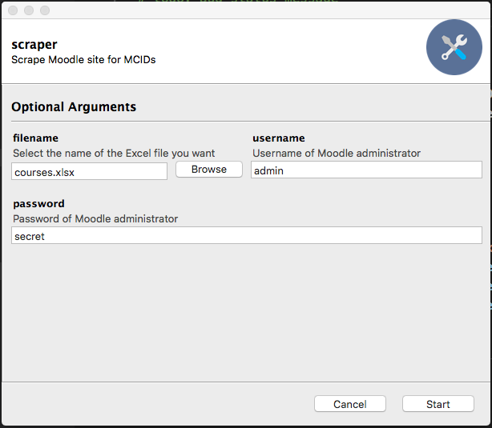

# Scraper
## Abtract
Scraper is intended to automatically retreive deep links to Dematic Training content. It requires three things of the user:
1) the username of an administrator account
2) the account's password
3) a filename to receive an Excel spreadsheet holding many rows and two columns

The Excel spreadsheet generated contains this:

  - The first row is a descriptive header
  - Each subsequent row represents one course
  - The course name is in column one
  - A deep link to course content is in column two

## Command Line Usage

Scraper accepts three parameters:

|  terse  |  verbose     | Description                               |
| :-----: | :----------: | ----------------------------------------- |
|    -f   |  --filename  | A filename to accept an Excel spreadsheet |
|    -u   |  --username  | The username of an administrator account  |
|    -p   |  --password  | The password of an administrator account  |

### Example

python3 Scraper.py -f courses.xlsx -u admin -p secret

This will run python from the command line which in turn runs Scraper.py with a filename of "courses.xlsx" with a username of "admin" using a password of "secret"

## GUI Usage

The Graphical User Interface is equivalent to the Command-line interface, but it presents this dialog to the user:

Fill out the filename, username, and password text boxes then click the "Start" button. Scraper will do its thing and announce when it is finished.
